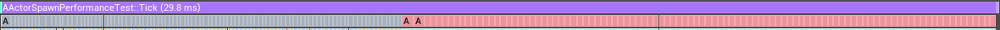
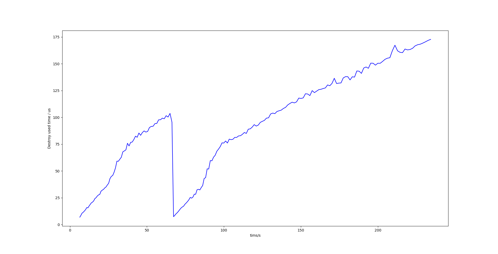

# Actor 生成与销毁性能 ，以及 ActorPool 的必要性

 说明：以下示例代码来自于 Unreal Engine 5.1.1，ObjectPool代码以及测试蓝图来自 ***[对象池子系统插件](https://github.com/HankTassadar/ObjectPoolSubsystem "对象池子系统插件")*** ，以下关于性能的讨论只针对GameThread。

## 0. 概述

试想这样一个场景，我们有一个游戏，需要在游戏中生成大量的 Actor，比如子弹，怪物，道具等等，这些 Actor 都是需要在游戏中动态生成的，而且这些 Actor 的数量是非常大的，比如同一时刻存在的子弹的数量可能会达到几千个，每Tick都会生成数百个的生成与销毁。这时进行性能优化的时候，我们进需要从以下几个方面考虑：Actor的生成，Actor的Tick，Actor的销毁。

本文主要分析一些 Actor 在生成与销毁时的性能消耗，进而讨论一些关于 ActorPool 必要性的问题。

## 1. Actor 的生成与销毁

### 1.1 Actor 的生命周期

在 UE 中，Actor 的生命周期主要分为以下几个阶段：

    (1) New 出一个 Actor
    (2) Actor 初始化
    (3) BeginPlay
    (4) Tick，响应输入与事件
    (5) EndPlay
    (6) 销毁 Actor，等待 GC
    (7) Actor 被 GC 回收

上述过程中， Actor 的 New ，初始化与 BeginPlay 通常是一起完成的，当延迟生成时会分开完成，EndPlay 与销毁 Actor 通常是一起完成的。

### 1.2 Actor 的生成

我们可以通过调用 UWorld::SpawnActor 来生成一个 Actor，这个函数的声明如下：

```cpp
AActor* SpawnActor( UClass* Class, FTransform const* Transform, const FActorSpawnParameters& SpawnParameters = FActorSpawnParameters());
```

想要生成一个 Actor ，我们只需要知道它的类型，以及生成时的坐标变换信息即可。

在这个函数当中，我们省略一些非重点代码，只关注Actor的流程：

```cpp
AActor* UWorld::SpawnActor( UClass* Class, FTransform const* UserTransformPtr, const FActorSpawnParameters& SpawnParameters)
{
...
//一串if判断，判断是否可以生成Actor
...
//编辑器相关，Actor名称等
...
//碰撞相关，是否允许发生碰撞生成
...
    // actually make the actor object
    AActor* const Actor = NewObject<AActor>(LevelToSpawnIn, Class, NewActorName, ActorFlags, Template, false/*bCopyTransientsFromClassDefaults*/, nullptr/*InInstanceGraph*/, ExternalPackage);
...
    if ( GUndo )
    {
        ModifyLevel( LevelToSpawnIn );
    }
    LevelToSpawnIn->Actors.Add( Actor );
    LevelToSpawnIn->ActorsForGC.Add(Actor);
...
    // Broadcast delegate before the actor and its contained components are initialized
    OnActorPreSpawnInitialization.Broadcast(Actor);

    Actor->PostSpawnInitialize(UserTransform, SpawnParameters.Owner, SpawnParameters.Instigator, SpawnParameters.IsRemoteOwned(), SpawnParameters.bNoFail, SpawnParameters.bDeferConstruction);
...
    Actor->CheckDefaultSubobjects();

    // Broadcast notification of spawn
    OnActorSpawned.Broadcast(Actor);
...
}
```

生成一个Actor的流程主要是 NewObject，然后添加到 Level 的 Actor 数组当中，然后调用 Actor 的 PostSpawnInitialize 函数，最后调用 Actor 的 CheckDefaultSubobjects 函数。

注意 PostSpawnInitialize 函数的调用时的最后一个参数 SpawnParameters.bDeferConstruction，这个参数的作用是是否延迟 Actor 生成到 Level 中，如果为 true ，则 Actor 不会被生成到 Level 中直到主动调用了 Actor 的 FinishSpawning 函数。

于是我们可以通过这里入手预先构造出 Actor，然后在需要的时候再调用 FinishSpawning 函数，这样就可以避免在游戏中频繁的生成 Actor 了。

### 1.3 Actor 生成的性能消耗

接下来我们使用  ***[对象池子系统插件](https://github.com/HankTassadar/ObjectPoolSubsystem "对象池子系统插件")*** 中的 BP_PerformanceTest 来测试一下生成过程中各个函数的性能消耗，测试中生成的是一个只有一个 StaticMeshComponent 的 Actor， 每 Tick 生成 100 个该对象。简化 SpawnActor 的流程到 ActorSpawnPerformanceTest::SpawnActors 中，然后每 Tick 生成固定数量的 Actor ，然后销毁掉。使用 TRACE_CPUPROFILER_EVENT_SCOPE 宏来测量各个过程的消耗。

使用 Unreal Insights 查看性能消耗，截取其中一次 Tick 如下：


可以看到，多次 SpawnActor 然后 Destroy 时， 生成时的性能消耗占比较大（不一定，会有例外，之后会讨论销毁性能）。

然后我们再来看一下具体的单次 SpawnActor 消耗：
<details>
<summary>AActorSpawnPerformanceTest::SpawnActors</summary>

```cpp

AActor* AActorSpawnPerformanceTest::SpawnActors()
{
    TRACE_CPUPROFILER_EVENT_SCOPE(AActorSpawnPerformanceTest::SpawnActors);
    FName name = FName(*FString::Printf(TEXT("AActorSpawnPerformanceTest_Actors_%d"), SpawnNameUnique++));
    ULevel* level = GetLevel();
    AActor* actor = nullptr;

    {
        TRACE_CPUPROFILER_EVENT_SCOPE(AActorSpawnPerformanceTest::SpawnActors_NewObject);
        actor = NewObject<AActor>(level, ActorToSpawn, name, EObjectFlags::RF_Transactional);
    }

    if (!actor)
    {
        return nullptr;
    }

    {
        TRACE_CPUPROFILER_EVENT_SCOPE(AActorSpawnPerformanceTest::SpawnActors_AddToLevel);
        level->Actors.Add(actor);
        level->ActorsForGC.Add(actor);
    }

    {
        TRACE_CPUPROFILER_EVENT_SCOPE(AActorSpawnPerformanceTest::SpawnActors_PostSpawnInitialize);
        actor->PostSpawnInitialize(FTransform(), nullptr, nullptr, false, false, true);
    }

    {
        TRACE_CPUPROFILER_EVENT_SCOPE(AActorSpawnPerformanceTest::SpawnActors_CheckDefaultSubobjects);
        actor->CheckDefaultSubobjects();
    }

    {
        TRACE_CPUPROFILER_EVENT_SCOPE(AActorSpawnPerformanceTest::SpawnActors_FinishSpawning);
        actor->FinishSpawning(FTransform());
    }

    return actor;
}
```

</details>


可以看到大部分的消耗是在最后的 FinishSpawning 上。我们详细看一下这个函数。

```cpp
void AActor::FinishSpawning(const FTransform& UserTransform, bool bIsDefaultTransform, const FComponentInstanceDataCache* InstanceDataCache)
{
...
//一些非重点代码
...
    {
        FEditorScriptExecutionGuard ScriptGuard;
        ExecuteConstruction(FinalRootComponentTransform, nullptr, InstanceDataCache,bIsDefaultTransform);
    }

    {
        SCOPE_CYCLE_COUNTER(STAT_PostActorConstruction);
        PostActorConstruction();
    }
}
```

ExecuteConstruction 中对这个 Actor 拥有的 Component 进行了生成，包括一些蓝图中的组件以及调用蓝图的 ConstructionScript。
PostActorConstruction 主要进行一些初始化操作，并调用了 BeginPlay。

为具体查看这两个过程的消耗，我们使用 AActorSpawnPerformanceTest::TestFinishSpawning 来替换这个 AActor::FinishSpawning ，结果如下：


可以看到， ExecuteConstruction 占用了 FinishSpawning 95% 的消耗，而 PostActorConstruction 只占用了 5% 的消耗。

如果生成的 Actor 比较复杂，拥有的组件很多，那么在 ExecuteConstruction 时性能消耗会更大。

### 1.4 Actor 的销毁

销毁 Acotr 时我们需要调用 AActor::Destroy ，但实际上的销毁逻辑在 UWorld::DestroyActor ，这个函数的声明如下：
    
```cpp
bool DestroyActor( AActor* Actor, bool bNetForce=false, bool bShouldModifyLevel=true );
```

省略一些非重点内容，我们看一下销毁流程：

```cpp
bool UWorld::DestroyActor( AActor* ThisActor, bool bNetForce, bool bShouldModifyLevel )
{
...
//一些是否可销毁的判断
...
    OnActorDestroyed.Broadcast(ThisActor);

    // Tell this actor it's about to be destroyed.
    ThisActor->Destroyed();
...
// Detach this actor's children, 释放所有的子 Actor
...
// Detach from anything we were attached to，从父 Actor 中释放
...
    ThisActor->ClearComponentOverlaps();
...
//一下NetDriver相关的内容
...
    // Remove the actor from the actor list.
    RemoveActor( ThisActor, bShouldModifyLevel );
...
    // Clean up the actor's components.
    ThisActor->UnregisterAllComponents();

    // Mark the actor and its direct components as pending kill.
    ThisActor->MarkAsGarbage();
    ThisActor->MarkPackageDirty();
    ThisActor->MarkComponentsAsPendingKill();

    // Unregister the actor's tick function
    const bool bRegisterTickFunctions = false;
    const bool bIncludeComponents = true;
    ThisActor->RegisterAllActorTickFunctions(bRegisterTickFunctions, bIncludeComponents);

    // Return success.
    return true;
}
```

主要流程为 Actor 调用 Destroyed 来调用 EndPlay ，然后清理组件重叠，从关卡的 ActorList 中移除，取消注册组件，标记为垃圾，取消注册 Tick。

### 1.5 Actor 销毁的性能消耗

我们来对比一下测试刚开始时的 Tick 和测试快结束时的 Tick。
刚开始时：


快结束时：



可以看出销毁相同数量的 Actor ，所用的时间越来越长。
我们导出销毁的数据，将其绘制成图表如下：



销毁单个 Actor 的时间消耗从开始的 10us 左右，到最后的 175us 左右。并且 60s 时销毁时间突降至刚开始的水平。

从图中可以看出单次销毁时间呈线性增长，但单次生成时间没有太多变化。这是因为生成时将 Actor 添加到了 Level 的 ActorList(ULevel::Actors, ULevel::ActorsForGC) 中，而销毁时需要从 ActorList 中移除，ActorList 是一个数组，销毁时从数组中查找占用了大量时间， 随着 ActorList 的增长，查找的时间也会增长。

我们仔细看一下销毁时从 ActorList 中移除的函数 RemoveActor ：

```cpp
void UWorld::RemoveActor(AActor* Actor, bool bShouldModifyLevel) const
{
    if (ULevel* CheckLevel = Actor->GetLevel())
    {
        const int32 ActorListIndex = CheckLevel->Actors.Find(Actor);
        // Search the entire list.
        if (ActorListIndex != INDEX_NONE)
        {
            if (bShouldModifyLevel && GUndo)
            {
                ModifyLevel(CheckLevel);
            }

            if (!IsGameWorld())
            {
                CheckLevel->Actors[ActorListIndex]->Modify();
            }

            CheckLevel->Actors[ActorListIndex] = nullptr;

            CheckLevel->ActorsForGC.RemoveSwap(Actor);
        }
    }

    // Remove actor from network list
    RemoveNetworkActor( Actor );
}
```

从代码中可以看到从 ULevel::Actors 中查找到 Actor 的索引，只是将这个索引对应的元素置空，并没有将这个元素从数组中移除，可以想象，随着我们不断的生成与销毁 Actor ，这个数组会越来越大，而且数组中会有很多空元素，这样在查找时就会消耗更多的时间。

在测试的 Tick 中，我们每一次 Tick 使用日志记录了 ActorList 的长度，将其绘制成图表并与上图进行对比：


对比上面两张图，可以判断出销毁时间与 ActorList 的长度成正相关。性能的消耗确实在这个数组的查找上。

在 60s 时销毁时间降至刚开始的水平，这是因为在 60s 时触发了垃圾收集，在收集垃圾后对ActorList 进行了收缩，移除了所有的空元素。

接下来我们看垃圾收集的情况，整个测试过程中 只有 60s 时触发了垃圾收集。


这次垃圾收集耗时极长，因为这一次收集了2-3万个 Actor，导致了这一帧一半以上的时间都用于 GC ，如果实际游戏中出现这么长的 GC ，会极大影响游戏体验。

收集完成后进行垃圾处理，垃圾处理函数 IncrementalPurgeGarbage 的耗时的散点图如下：


可以看到 60s 触发垃圾收集后，就一直以每 Tick 使用 2ms 销毁垃圾的速度进行，并且一直在处理没有间断直到测试终止。并且测试终止时出现了一次长达 5s 的垃圾销毁。

这也能解释为什么只有 60s 的时候进行了 GC ，因为这一次的 GC 处理的对象太多了，之后一直到测试终止前都没有处理完第一次 GC 的对象。所以上面的 Actors Size 图表中看到 60s 时缩减了数组的长度，而之后一直在增加。

如果一直以这个速率持续的生成销毁 Actor ，在这次 GC 彻底处理完成之前，不断的生成销毁会导致下一次 GC 需要处理的对象更多，然后恶性循环，始终有大量的对象等待 GC 处理，这样就会导致游戏的性能越来越差，直到崩溃。

### 1.6 总结

生成的过程中，很多步骤并不是一定要在使用这个对象的时候才进行，对于频繁使用的对象，完全可以在加载时就生成好。销毁时也一样，并非一定要把工作全都交给 GC ，多次复用同一个对象，可以减少 GC 的压力。

## 2. ActorPool的必要性

## 3. ***[对象池子系统插件](https://github.com/HankTassadar/ObjectPoolSubsystem "对象池子系统插件")*** 的设计与实现
